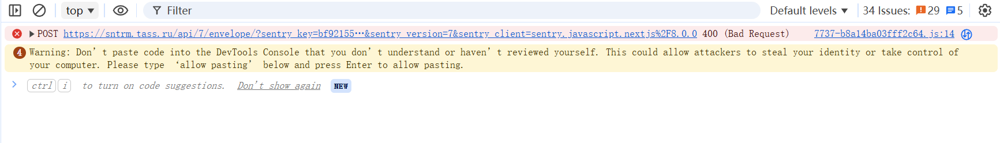

# 爬虫代码语料库

## 文件1:extract_keyword.py

命令：python extract_keyword.py

描述：直接前端扒链接，可自动翻页或者加载更多，关键词和链接均可直接更改

缺点：动态加载网站失效

## 文件2：11.py(tass社网站)

命令：python 11.py

描述：调用api接口使用cURL

可手动更改代码中搜索的关键词

缺点：无法全部扒下来，有数量限制

## 文件3：shoudongtass.py(tass社网站)

### 版本迭代

#### v1缺陷触发了反爬机制

#### v2利用 Google Translate 代理（最取巧的“白嫖”法）

这是一个非常经典的漏洞。Google 翻译的预览功能可以作为中转代理。你不是直接访问 TASS，而是请求 Google 去访问 TASS 并把翻译后的页面给你。

* **原理** ：TASS 永远不会封禁 Google 的爬虫 IP。
* **做法** ：将你的 URL 改造成：`https://translate.google.com/translate?sl=auto&tl=en&u=https://tass.com/economy/12345`。
* **优点** ：不需要换 IP，不需要处理验证码。
* **缺点** ：解析 HTML 的选择器需要根据 Google 翻译的页面结构稍微调整。

#### v3针对 Google 翻译方案报 **429 (Too Many Requests)** 的情况，这份完整代码引入了  **“自愈机制”** 

1. **动态休眠** ：一旦检测到 429 报错，程序会自动休眠 60 秒并跳过当前条目，防止 IP 被封死。
2. **拟人化 Headers** ：增加了 `Referer` 和更现代的浏览器标识。
3. **关键词兼容** ：同时匹配 “Huawei” 和翻译后的 “华为”。
4. **随机步长** ：每次请求间的等待时间设为 6-12 秒。

#### v4追求的是 **数据完整性** 。上个版本的“自愈机制”为了保住 IP，采取了“遇到 429 就跳过”的策略，这确实会导致部分文章的语料丢失

* **原地重试** ：遇到 429 不再跳过，而是原地进入“深度休眠”，醒来后重新请求当前链接，直到成功为止。
* **多语种增强** ：同时检索中、英、俄三种关键词，防止翻译导致的条目丢失。
* **动态请求头** ：每次重试都会更换 `User-Agent`，降低被 Google 盯着不放的概率。

### 使用说明

网页爬虫语料库，输入网址和关键词，输出相关语句的csv文件

**既然“硬攻” API 不行，我们换一个 100% 成功的“本地提取法”。**

既然你在浏览器里能看到 2115 条结果，说明数据已经下发到了你的浏览器。我们可以利用浏览器里的 **“控制台 (Console)”** 一秒钟把所有链接导出来，然后用 Python 去爬正文。

#### 第一步：从浏览器提取所有链接（最关键）

1. 在浏览器搜索 `Huawei`。
2. **不断向下滑动** ，直到 2115 条结果全部加载出来（或者加载到你满意的数量）。
3. 按 **F12** 打开开发者工具，点击  **Console (控制台)** 。
4. 粘贴下面这段代码并按  **回车** ：

**JavaScript**

```
// 提取页面上所有的文章链接和标题
let links = [];
document.querySelectorAll('a').forEach(a => {
    let href = a.getAttribute('href');
    if(href && href.includes('/') && a.innerText.length > 10){
        links.push(a.innerText.replace(/\n/g, "") + "," + "https://tass.ru" + href);
    }
});
// 打印出来，你可以直接复制
console.log(links.join('\n'));
```

5. 此时控制台会打印出几千行链接。将这些内容 **复制并保存** 到你电脑上的一个文件里，命名为 `urls.txt`（放在 `11.py` 同一个文件夹下）。

##### 可能遇到的问题



这是浏览器为了保护你的安全而设置的**“防诈骗”安全机制**。

简单的说，浏览器担心你从网上随便复制了一段恶意代码（可能会偷你的账号密码或 Cookie），所以默认禁止了在控制台（Console）粘贴代码的功能。

###### 解决方法：

1. 在控制台蓝色的 `>` 符号后面，手动用键盘输入： **`allow pasting`**
2. 按下  **Enter (回车键)** 。
3. 现在你就可以重新粘贴我刚才给你的那段 JavaScript 代码了。

---

###### 操作建议：

* **第一步** ：输入 `allow pasting` 并回车。
* **第二步** ：粘贴我给你的链接提取代码。
* **第三步** ：如果成功，你会看到控制台打印出一大串链接。把它们全部复制出来，存到 `urls.txt` 里面。

---

#### 第二步：使用 Python 读取文件并爬取语料

现在链接已经在你本地了，Python 只需要负责访问网页提取包含 "Huawei" 的句子。这个过程不需要任何复杂的 API Cookie，非常稳定。

在文件中如下代码段更改配置

INPUT_FILE ="urls.txt"      # 你刚才保存链接的文件

OUTPUT_FILE ="huawei_corpus.csv"#这里更改输出文件名称

KEYWORD ="Huawei"#这里更改搜索关键词

命令：python shoudongtass.py
